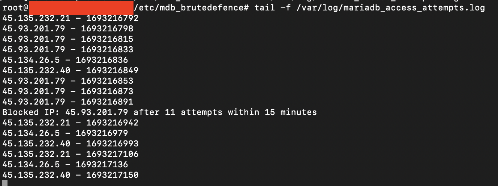

# BruteDefence

The script was written to monitor, log and respond to suspicious attempts on a MariaDB server, specifically targeting unauthorized connection attempts.

## 1. Monitoring script

The first script (`monitor_mariadb.sh`) was designed to continously monitor the MariaDB status for access denied warnings. The functionality are as follows:

- Real-time monitoring: Utilizes `journalctl` to monitor the MariaDB status in real time.
- Username and IP Extraction: Extracts the username and IP address from access denied warnings.
- Logging Attempts: Logs the username and IP address and the number of attempts to a specified log file.
- Blocking Threshold: Calculate the average attempts of the username and IP, and dynamically set the threshold to block the suspicious attempts.
- Blocking IP: If the username and IP address surpassed the threshold, it is blocked using `iptables`.

### POC

## 2. Log rotation configuration

The second part of the solution involves setting up log rotation for the log file created by the monitoring script. This is done using the `logrotate`. The functionality are as follows:

- Scheduled rotation: Rotates the log file based on a defined schedule.
- File retention: Keeps a specidied number of old log files, compressing them to save space.
- Error handling: Includes options to handle missing log files or empty log files gracefully.
- Permission management: Ensures that new log files have the correct permissions and ownership.

## HOW TO USE

1. Make it executable: Run `chmod +x monitor_mariadb.sh`
2. Run the script: `sudo ./monitor_mariadb.sh`

## SETTING THE PROPER PERMISSIONS

``sudo chmod 0644 /etc/logrotate.d/mariadb_access_attempts``

``sudo chown root:root /var/log/mariadb_access_attempts.log``

## TESTING

``sudo logrotate -d /etc/logrotate.d/mariadb_access_attempts``

## MANUAL EXECUTION

``sudo logrotate /etc/logrotate.d/mariadb_access_attempts``

## NOTES

1. The script use `journalctl` to monitor the MariaDB status, so it requires root privileges.
2. The script logs the username and IPs and attempts to the specified log file and block the IP using `iptables` if the attempts are greater than the calculated threshold.

Created and maintained by @ridhzie - <https://github.com/ridhzie>
